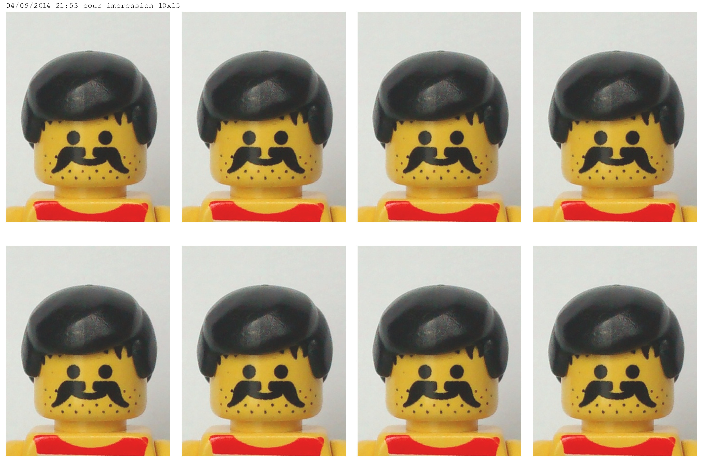

## Création de planche photos à partir d'une photo d'identité

Cet outil construit une planche de 8 photos à partir d'une seule photo d'identité. Pour un résultat optimal :

* Le ratio largeur / hauteur de la photo initiale doit suivre les recommandations officielles (pour la France) et être équivalent à ~ 0.778 (35/45).
* La résolution de la photo initiale doit être au moins de 840 x 1080 px.
* L'impression de la planche doit se faire sur du papier photo 10 x 15 cm.

Si toutes ces recommandations sont respectées, les photos d'identité sur la planche auront la taille réglementaire (en France) de 3,5 x 4,5 cm.

Utilisation :

	creation_planche_photos.sh bob.jpg

Va produire la planche de photos bob_planche.jpg avec 8 fois la photo bob.jpg. 

